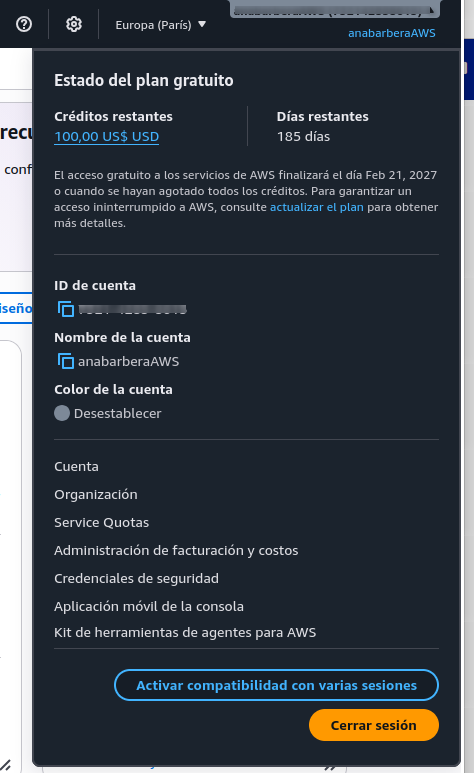
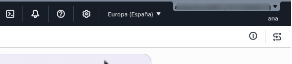
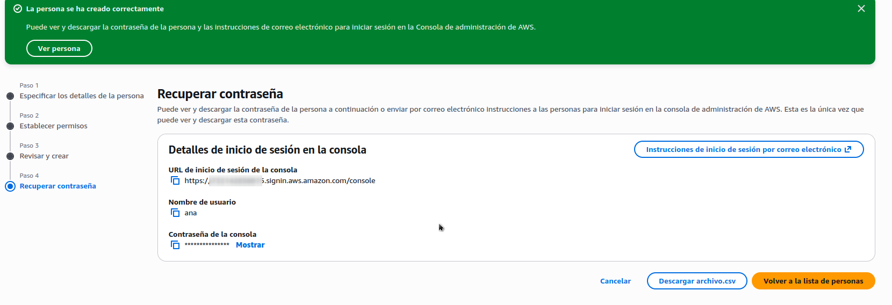
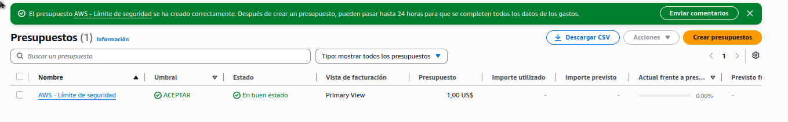
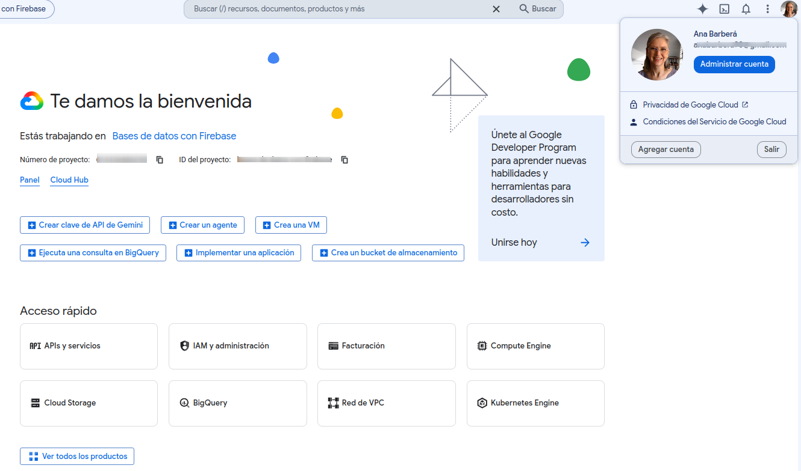
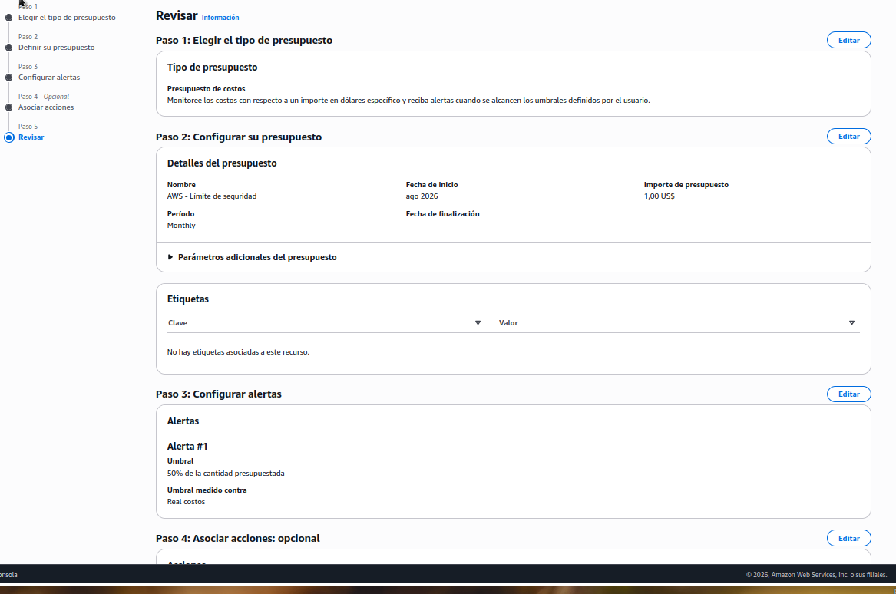
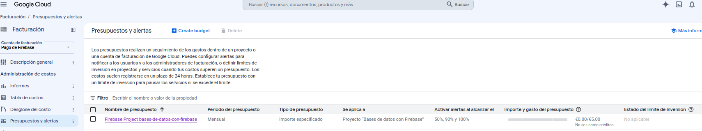
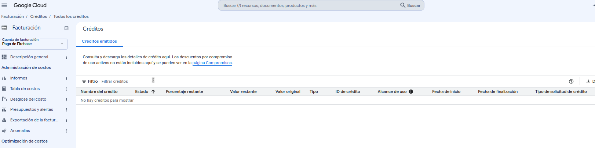
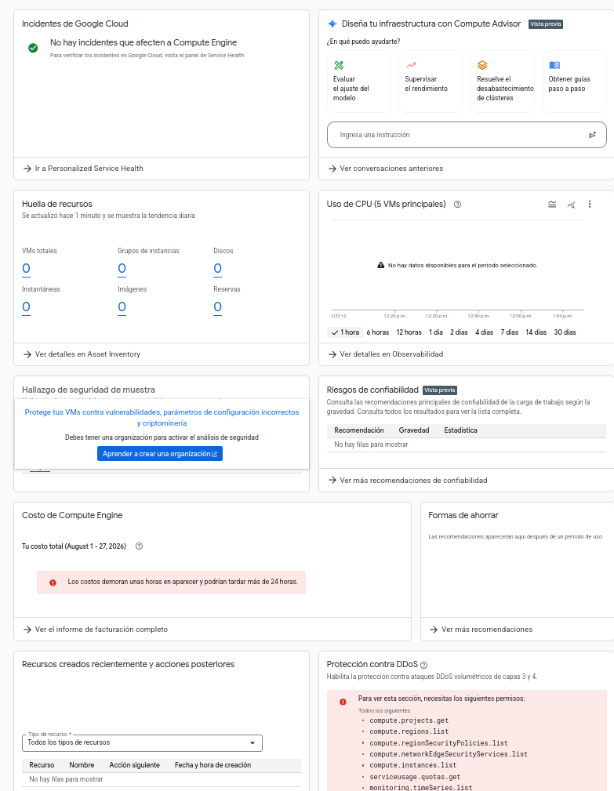

# Reto 1: Configuración de Entornos Cloud y Gestión de Costes (AWS & GCP)

## Objetivo

Establecer las bases operativas en Amazon Web Services (AWS) y Google Cloud Platform (GCP), configurando las consolas de administración y aplicando buenas prácticas de control de costes para mantener el entorno dentro de las opciones gratuitas disponibles.

## Proceso de Implementación

### 1. Alta y Configuración en AWS

Accedí a la consola de AWS y configuré el panel principal. Para asegurar la cuenta, validé los accesos básicos.

_(Nota: Información sensible como ID de cuenta y usuario root han sido pixelados por seguridad)._

También configuré la autenticación multifactor (MFA), un presupuesto para controlar los costes (con alertas), así como un usuario IAM manejando permisos y roles. Accediendo mediante ese usuario podemos ver que aparece en el menú (arriba-dcha) debajo de nuestra cuenta.

### Evidencias adicionales

- [Configuración MFA](./img/aws_mfa.png)
- Configuración del usuario IAM:

  [Paso 1](./img/aws_user1.png)

  [Paso 2](./img/aws_user2.png)

  [Paso final](./img/aws_user4.png)

  

- [Configuración de presupuesto](./img/aws_presup_pasos.png)

- [Estado del presupuesto](./img/aws_presup_status.png)

- 

### 2. Alta y Configuración en GCP

**Accedí a la consola de Google Cloud y configuré el proyecto "Bases de datos con Firebase", revisando la estructura de facturación, los permisos IAM y los principales servicios disponibles.**

Como parte de la configuración inicial se revisaron los principales recursos y servicios del proyecto:

- **IAM:** se identificaron las cuentas de usuario y cuentas de servicio utilizadas por el proyecto.
- **Compute Engine:** no existen máquinas virtuales creadas.
- **Cloud Storage:** existen tres buckets asociados al proyecto, incluyendo el utilizado por Firebase Storage.
- **APIs y servicios:** se revisó el listado de APIs habilitadas y su actividad reciente.
- **Facturación:** el coste registrado actualmente es de 0,00 €.

Esta revisión permite conocer los recursos existentes antes de comenzar a desplegar nuevos servicios.

### Evidencias adicionales

**- Información de facturación:**

**[Vista general de facturación](./img/gcp_billing_overview.png)**

**[Estado de la cuenta de facturación](./img/gcp_billing_status.png)**

**[Proyectos vinculados a la cuenta de facturación](./img/gcp-billing-projects.png)**

**[Créditos disponibles](./img/gcp-billing-credits.png)**

**- Configuración de presupuesto y alertas:**

**[Configuración del presupuesto y alertas](./img/gcp-budget-alerts.png)**

**- Gestión de identidades y permisos (IAM):**

**[Configuración IAM del proyecto](./img/gcp_iam.png)**

**- Servicios e infraestructura:**

**[Compute Engine](./img/gcp_compute_engine.png)**

**[APIs y servicios habilitados](./img/gcp-apis-services.png)**

**[Cloud Storage - Buckets](./img/gcp-cloud-storage.png)**

### 3. Estrategia de Control de Costes

Para reducir el riesgo de cargos inesperados, configuré mecanismos de control de costes tanto en AWS como en GCP.

#### AWS

Se configuró un presupuesto con alertas para controlar el consumo y recibir notificaciones cuando el gasto alcance los umbrales establecidos.

#### GCP

En GCP revisé la cuenta de facturación y configuré un presupuesto mensual de 5 €, estableciendo alertas al alcanzar el 50 %, 90 % y 100 % del presupuesto.

Actualmente el gasto registrado es de 0,00 €, por lo que el proyecto se mantiene dentro del objetivo de control de costes.

También se verificó que actualmente no existen créditos disponibles en la cuenta de facturación.

Se revisaron además los recursos desplegados para comprobar que no existen máquinas virtuales de Compute Engine activas.

## Buenas Prácticas de Seguridad Aplicadas

- **Ofuscación de datos:** se ocultaron IDs de cuenta, correos electrónicos y otros datos sensibles presentes en las capturas de pantalla.
- **Autenticación multifactor:** se configuró MFA para reforzar la seguridad de la cuenta de AWS.
- **Separación de responsabilidades:** se creó un usuario IAM para las tareas habituales, evitando utilizar directamente la cuenta Root.
- **Control de costes:** se configuraron presupuestos y alertas en AWS y GCP.
- **Revisión de recursos:** se comprobaron los principales recursos activos para evitar mantener servicios innecesarios.
- **Seguimiento de facturación:** se verificó periódicamente el coste acumulado de los proyectos.

## Conclusión

La configuración inicial de los entornos AWS y GCP queda establecida, incluyendo las medidas básicas de seguridad, gestión de identidades y control de costes.

Actualmente ambos entornos se mantienen bajo control, sin costes relevantes registrados, y cuentan con mecanismos de alerta para detectar posibles incrementos de consumo.

Esta configuración proporciona una base segura para continuar con los siguientes retos y comenzar a desplegar recursos cloud de forma controlada.
