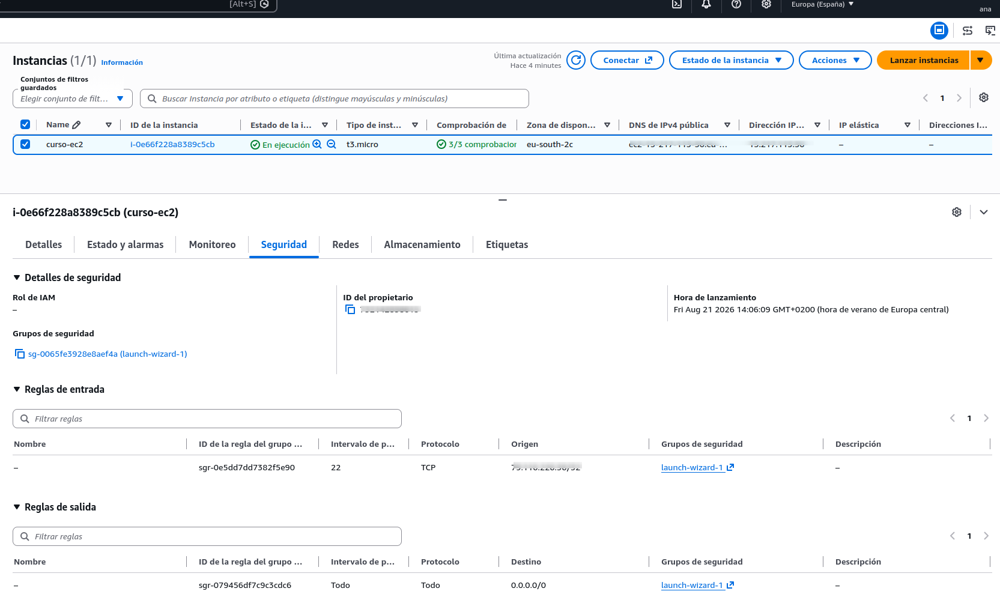
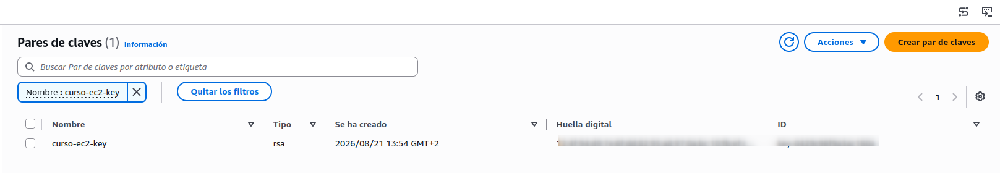
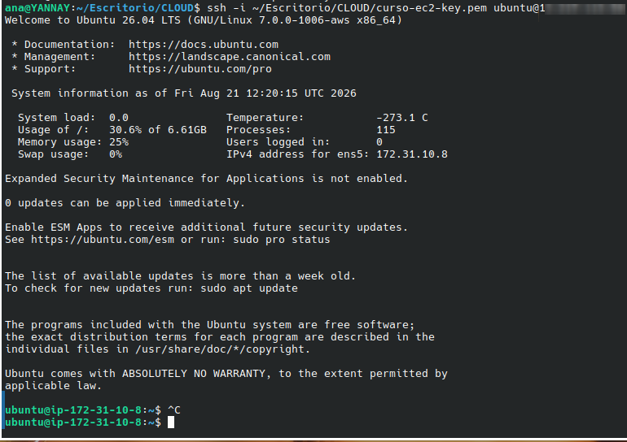
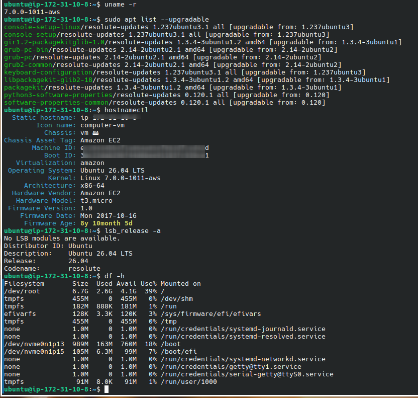

# Reto 2: Despliegue de Servidor Virtual (AWS EC2) y Configuración Linux via SSH

## Objetivo

Desplegar una instancia virtual EC2 en AWS de forma segura, establecer conexión remota mediante llaves criptográficas (SSH) y realizar el aprovisionamiento inicial del sistema operativo Linux.

## Guía Paso a Paso

### Paso 1: Lanzamiento de la Instancia EC2

Se desplegó una instancia EC2 `t3.micro` en la región
Europe (Spain) (`eu-south-2`) utilizando Ubuntu 26.04 LTS.

La instancia dispone de un grupo de seguridad que permite
conexiones SSH únicamente desde la dirección IP pública del
equipo utilizado para la administración.

[Lanzamiento de Instancia EC2](./img/aws_ec2.png)

[Instancia EC2 OK](./img/aws_ec2_ok.png)

[Instancia en ejecución y Configuración del grupo de seguridad](./img/aws-ec2-security-group.png)



### Paso 2: Conexión Segura por SSH

La conexión administrativa se realizó mediante SSH utilizando
un par de claves.





Una vez establecida la conexión, se actualizaron los paquetes
del sistema y se reinició la instancia para cargar el nuevo
kernel.

### Paso 3: Configuración y Actualización del Sistema

Una vez dentro de Linux, ejecuté la actualización de los repositorios y del software del sistema para asegurar la estabilidad y parches de seguridad:

```bash
sudo apt update && sudo apt upgrade -y
```



## 💡 Aprendizajes Clave

- Gestión de llaves SSH y permisos en entornos Unix.
- Ciclo de vida básico de una instancia de computación en la nube.
