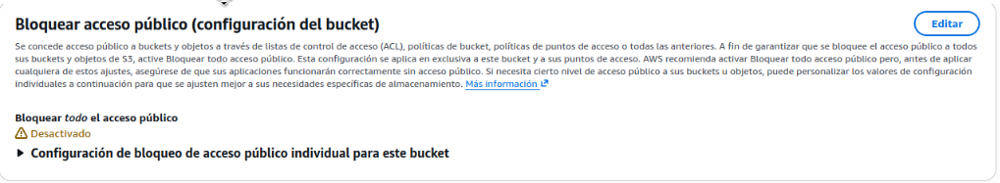

# Reto 3 — Almacenamiento y recuperación de archivos

**[Portfolio](../README.md) › Reto 3**

## Objetivo

En este reto se trabaja con servicios de almacenamiento de objetos en la nube.

En la parte correspondiente a **AWS**, se utiliza **Amazon S3** para:

- Crear un bucket de almacenamiento.
- Subir un archivo.
- Configurar los permisos de acceso.
- Generar una URL segura y temporal para recuperar el archivo.
- Comprobar la diferencia entre acceso privado, acceso mediante URL prefirmada y acceso público.

> **Nota de seguridad:** durante el desarrollo del reto se evitó almacenar información sensible. El acceso público se habilitó únicamente de forma temporal para realizar una prueba y posteriormente se volvió a bloquear.

---

# AWS — Amazon S3

## 1. Creación del bucket

Se creó un bucket de Amazon S3 denominado:

```text
ana-storage-reto3
```

El bucket se creó en la región:

```text
Europa (España) — eu-south-2
```

Se mantuvo activado el **bloqueo de acceso público** y se utilizó el cifrado predeterminado **SSE-S3**.


### Configuración utilizada

| Configuración           | Valor                        |
| ----------------------- | ---------------------------- |
| Servicio                | Amazon S3                    |
| Bucket                  | `ana-storage-reto3`          |
| Región                  | Europa (España) `eu-south-2` |
| Propiedad de objetos    | Propietario del bucket       |
| ACL                     | Deshabilitadas               |
| Acceso público          | Bloqueado                    |
| Cifrado                 | SSE-S3                       |
| Clase de almacenamiento | S3 Standard                  |

---

## 2. Almacenamiento del archivo

Se creó y almacenó un archivo de prueba:

```text
reto3-aws.txt
```

El archivo contiene información de prueba relacionada con el ejercicio y tiene un tamaño de 70 bytes.

La consola de Amazon S3 confirmó que la carga se realizó correctamente.


El archivo quedó disponible dentro del bucket:

```text
ana-storage-reto3/
└── reto3-aws.txt
```

---

## 3. Configuración de permisos

### Propiedad de objetos

El bucket utiliza la configuración:

> **Imposición de propietario del bucket (Bucket owner enforced)**

Con esta configuración, las ACL están deshabilitadas y la gestión del acceso se realiza mediante políticas de IAM y políticas del bucket.

[Configuración de permisos](./img/aws_S3_permissions.png)

### Bloqueo de acceso público

Se mantuvo activada la opción:

> **Bloquear todo el acceso público**

Esta configuración impide que las políticas o ACL puedan conceder accidentalmente acceso público al bucket u objetos.

[Bloqueo del acceso público](./img/aws_S3_public_access.png)

Esta configuración permite mantener los archivos privados y conceder acceso temporal cuando sea necesario mediante una URL prefirmada.

---

## 4. URL segura para recuperar el archivo

Para permitir el acceso temporal al archivo sin hacerlo público se utilizó una **URL prefirmada (presigned URL)**.

Desde AWS CloudShell se ejecutó:

```bash
aws s3 presign s3://ana-storage-reto3/reto3-aws.txt --expires-in 3600
```

El parámetro:

```text
--expires-in 3600
```

establece una validez de **3600 segundos (1 hora)** para la URL generada.

La URL prefirmada contiene una firma temporal que permite acceder al objeto sin modificar la configuración de acceso público del bucket.

### Comprobación

La URL generada se abrió desde el navegador y permitió recuperar correctamente el contenido de `reto3-aws.txt`.


También se comprobó la recuperación mediante `curl` desde CloudShell:

```bash
curl -o reto3-aws-descargado.txt "URL_PREFIRMADA"
```

El archivo descargado se comprobó posteriormente con:

```bash
cat reto3-aws-descargado.txt
```

obteniendo el contenido original del archivo.

[Recuperación del archivo mediante URL en la consola](./img/aws_S3_download.png)

> **Seguridad:** las URL prefirmadas contienen información temporal de autenticación. Por este motivo, no se incluye ninguna URL prefirmada completa en el repositorio.

---

# 5. Prueba de acceso público

Como parte del aprendizaje se realizó también una prueba para comprobar cómo funciona el acceso público en S3.

## 5.1 Desactivación temporal del bloqueo

Se desactivó temporalmente **Bloquear todo el acceso público**.



Este cambio se realizó únicamente para comprobar el funcionamiento del acceso público y posteriormente se revirtió.

## 5.2 Política de bucket

Se añadió temporalmente una política que permitía la operación:

```text
s3:GetObject
```

sobre los objetos del bucket.

La política utilizada fue:

```json
{
  "Version": "2012-10-17",
  "Statement": [
    {
      "Sid": "PublicReadForReto3",
      "Effect": "Allow",
      "Principal": "*",
      "Action": "s3:GetObject",
      "Resource": "arn:aws:s3:::ana-storage-reto3/*"
    }
  ]
}
```

Esta política permite la lectura pública de los objetos, pero no concede permisos para:

- Subir archivos.
- Eliminar archivos.
- Modificar archivos.
- Listar el contenido del bucket.

[Política pública del bucket](./img/aws_S3_bucket_policy_public.png)

## 5.3 Comprobación mediante URL pública

Una vez aplicada la política, se pudo acceder al archivo mediante su URL pública, sin utilizar una URL prefirmada.

La prueba se realizó también desde una ventana privada del navegador para comprobar que el acceso no dependía de una sesión autenticada de AWS.


El contenido del archivo se mostró correctamente.

---

## 5.4 Restauración de la configuración segura

Una vez finalizada la prueba:

1. Se eliminó la política de acceso público.
2. Se volvió a activar **Bloquear todo el acceso público**.
3. Se comprobó nuevamente que el acceso mediante la URL pública producía un error de acceso.

De esta forma, el bucket volvió a quedar configurado como recurso privado.

---

# 6. Comparación de los métodos de acceso

Durante el ejercicio se comprobaron tres escenarios:

| Configuración  | Tipo de URL    | Resultado          |
| -------------- | -------------- | ------------------ |
| Bucket privado | URL prefirmada | ✅ Acceso temporal |
| Bucket público | URL normal     | ✅ Acceso público  |
| Bucket privado | URL normal     | ❌ `AccessDenied`  |

La configuración final del bucket es la más segura de las tres:

```text
Bucket privado
    │
    ├── Acceso público bloqueado
    ├── ACL deshabilitadas
    ├── Cifrado SSE-S3
    │
    └── Acceso temporal
            │
            └── URL prefirmada
```

## Conclusión

Con este ejercicio se ha comprobado el funcionamiento de **Amazon S3** como servicio de almacenamiento de objetos.

Se ha creado un bucket en la región de España, almacenado un archivo y configurado su acceso manteniendo el bucket privado.

Además, se ha comprobado mediante una URL prefirmada que es posible proporcionar **acceso temporal a un objeto privado sin habilitar el acceso público**.

Finalmente, se realizó una prueba controlada de acceso público mediante una política de bucket y se restauró la configuración segura original.

Esto permite diferenciar entre:

- **Acceso privado:** requiere permisos.
- **URL prefirmada:** acceso temporal y controlado.
- **URL pública:** cualquier usuario que disponga de la URL puede acceder mientras el recurso sea público.
