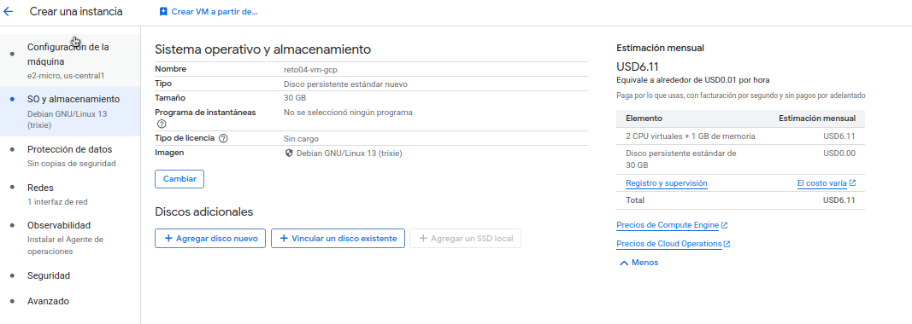
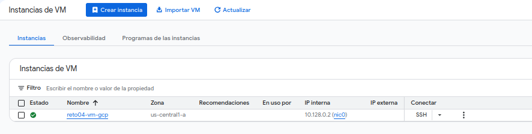
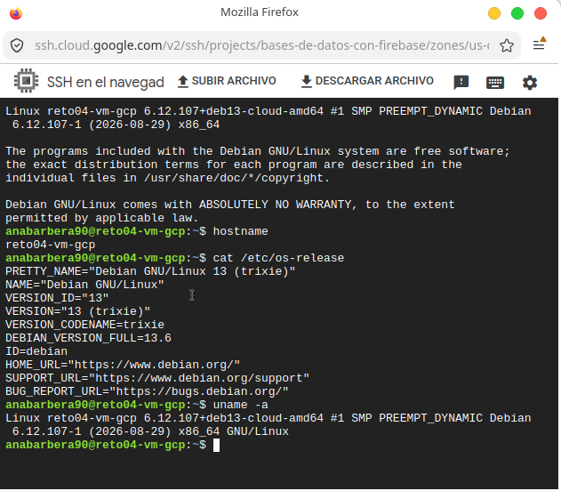

# Reto 4: Desplegar una máquina virtual en GCP y Microsoft Azure

**[Portfolio](../README.md) › Reto 4**

## Objetivo

El objetivo de este reto es aprender a desplegar y configurar una máquina virtual en servicios cloud, realizando la conexión remota y explorando las principales opciones de administración, seguridad, almacenamiento, red, monitorización y automatización.

Se trabaja con:

- **Google Cloud Platform (GCP)**: despliegue práctico de una máquina virtual.
- **Microsoft Azure**: investigación del proceso de despliegue y de los requisitos necesarios para utilizar una máquina virtual.

---

# 1. Google Cloud Platform — Compute Engine

## 1.1 Creación de la máquina virtual

Para comenzar, se accede a **Google Cloud Console → Compute Engine → Instancias de VM**.

Antes de crear la instancia fue necesario habilitar la API de **Compute Engine** para el proyecto.

La máquina virtual creada tiene las siguientes características:

| Configuración     | Valor                                |
| ----------------- | ------------------------------------ |
| Nombre            | `reto04-vm-gcp`                      |
| Zona              | `us-central1-a`                      |
| Tipo de máquina   | `e2-micro`                           |
| CPU               | 2 vCPU virtuales / núcleo compartido |
| Memoria           | 1 GB                                 |
| Sistema operativo | Debian GNU/Linux 13 (trixie)         |
| Disco             | 30 GB Standard Persistent Disk       |
| GPU               | Ninguna                              |
| IP interna        | `10.128.0.2`                         |
| IP externa        | Ninguna                              |
| VPC               | `default`                            |
| Subred            | `default`                            |

[Configuración de la máquina virtual](./img/gcp-vm-config.png)

La instancia se ha creado sin dirección IPv4 externa. De esta forma se reduce la exposición directa de la máquina a Internet.

---

## 1.2 Configuración de la red

La máquina utiliza la red VPC predeterminada de Google Cloud y la subred `default`.

Al no disponer de una IP pública, la conexión SSH se realiza mediante **Identity-Aware Proxy (IAP)**.

Para permitir esta conexión fue necesario crear una regla de firewall que permite tráfico SSH:

- Dirección: **Entrada (Ingress)**
- Acción: **Permitir**
- Protocolo: **TCP**
- Puerto: **22**
- Rango de origen de IAP: `35.235.240.0/20`

Esta configuración permite acceder a la máquina mediante SSH sin asignarle una IP pública.

[Configuración de la red](./img/gcp-vm-redes.png)

---

## 1.3 Configuración del almacenamiento

La instancia dispone de un disco de arranque con:

- **30 GB**
- **Standard Persistent Disk**
- Interfaz **SCSI**
- Encriptación administrada por Google
- Sin programa de instantáneas configurado



El disco se utiliza como almacenamiento persistente de la máquina virtual.

---

# 2. Seguridad y acceso

La instancia utiliza las opciones de seguridad proporcionadas por Compute Engine.

Se encuentran activadas:

- **vTPM**
- **Supervisión de integridad**

El **arranque seguro (Secure Boot)** permanece desactivado.

El acceso SSH se realiza mediante las claves gestionadas por Google Cloud y mediante la conexión SSH desde la consola.

No se ha configurado una dirección IPv4 externa para la instancia.

## 

# 3. Acceso remoto mediante SSH

Una vez creada y configurada la máquina virtual, se realiza una conexión mediante **SSH** desde Google Cloud Console.

La conexión se establece mediante IAP debido a que la VM no dispone de IP externa.



Una vez dentro de la máquina se comprueba la identidad y el sistema operativo:

```bash
hostname
```

Resultado:

```text
reto04-vm-gcp
```

También se consulta la información del sistema:

```bash
cat /etc/os-release
```

La máquina utiliza:

```text
Debian GNU/Linux 13 (trixie)
```

Finalmente se comprueba la versión del kernel:

```bash
uname -a
```

Con estas comprobaciones se verifica que la conexión SSH funciona correctamente y que estamos trabajando sobre la máquina virtual creada.

---

# 4. Observabilidad y monitorización

Google Cloud proporciona herramientas de observabilidad para consultar el estado y el rendimiento de las máquinas virtuales.

Desde **Compute Engine → Observabilidad** se pueden consultar diferentes métricas:

- Uso de CPU
- Memoria
- Tráfico de red
- Uso del disco
- Procesos
- Registros
- Eventos del sistema
- Integraciones de monitorización

[Observabilidad de la máquina virtual](./img/gcp-observability.png)

Al tratarse de una máquina recién creada y con poca actividad, algunas métricas pueden mostrar que todavía no existen datos suficientes.

La observabilidad permite detectar problemas de rendimiento y conocer el comportamiento de las máquinas virtuales.

---

# 5. Gerenciamiento y políticas de disponibilidad

Dentro de la configuración de la instancia se pueden consultar las políticas relacionadas con su disponibilidad y mantenimiento.

La configuración utilizada es:

- **Modelo de aprovisionamiento:** Estándar
- **Interrumpibilidad:** Inactiva
- **Mantenimiento en el host:** Migrar instancia de VM
- **Reinicio automático:** Activado

[Políticas de disponibilidad y mantenimiento](./img/gcp-vm-maintenance.png)

La opción de migración permite que Google Cloud pueda mover la máquina virtual a otro hardware durante determinadas tareas de mantenimiento de la infraestructura.

El reinicio automático permite que Compute Engine reinicie la instancia automáticamente ante determinados fallos que no hayan sido provocados directamente por el usuario.

---

# 6. Metadatos y automatización

La instancia dispone de una sección de **Metadatos** donde se pueden almacenar valores de configuración que pueden ser consultados desde la propia máquina virtual.

En esta instancia aparece el metadato:

```text
enable-osconfig = TRUE
```

Este metadato permite habilitar funcionalidades relacionadas con **OS Config**, utilizadas para tareas de administración y gestión del sistema operativo.

---

## 6.1 Secuencia de comandos de inicio

Compute Engine permite configurar una **Secuencia de comandos de inicio (Startup Script)**.

Estos scripts se ejecutan automáticamente cuando la instancia se inicia o reinicia y permiten automatizar tareas de configuración.

Por ejemplo, podríamos utilizar un script para instalar y poner en funcionamiento un servidor web Nginx:

```bash
#!/bin/bash

apt-get update -y
apt-get install -y nginx
systemctl enable nginx
systemctl start nginx
```

Este script realizaría automáticamente las siguientes tareas:

1. Actualizar la información de los paquetes.
2. Instalar Nginx.
3. Configurar Nginx para iniciarse automáticamente.
4. Iniciar el servicio.

En esta práctica **no se ha configurado ni ejecutado este script**. Se muestra únicamente como ejemplo del uso de la funcionalidad de automatización.

[Secuencia de comandos de inicio](./img/gcp-vm-startup-script.png)

---

# 7. Tareas de mantenimiento

Durante la exploración de Compute Engine se han revisado diferentes opciones relacionadas con el mantenimiento de las máquinas virtuales:

- Reinicio automático.
- Migración durante el mantenimiento del host.
- Monitorización de CPU, memoria, red y disco.
- Gestión de registros y eventos.
- Administración del sistema operativo mediante OS Config.

Estas herramientas permiten mantener las máquinas virtuales controladas y detectar posibles problemas de funcionamiento.

Una vez finalizado el trabajo práctico, la instancia puede detenerse para evitar mantener recursos de computación activos innecesariamente.

---

# 8. Microsoft Azure

## 8.1 Investigación del despliegue de una máquina virtual

Como segunda parte del reto se ha investigado el proceso necesario para desplegar una máquina virtual en **Microsoft Azure**.

El procedimiento general consiste en:

1. Acceder al portal de Microsoft Azure.
2. Seleccionar o crear una suscripción.
3. Crear un grupo de recursos.
4. Seleccionar **Máquina virtual**.
5. Configurar:

   - Región.
   - Imagen del sistema operativo.
   - Tamaño de la máquina.
   - Método de autenticación.
   - Usuario administrador.
   - Red virtual.
   - Subred.
   - IP pública, si fuera necesaria.
   - Disco.

6. Revisar la configuración.
7. Crear la máquina virtual.
8. Conectarse posteriormente mediante SSH si se utiliza Linux.

---

## 8.2 Requisitos de acceso

En este reto, el acceso práctico a Azure está condicionado por los requisitos de la cuenta corporativa y por la necesidad de solicitar los recursos correspondientes.

Por este motivo, no se ha realizado un despliegue práctico de la VM en Azure.

Se ha documentado el procedimiento de despliegue y las opciones que sería necesario configurar para realizarlo.

---

# 9. Conclusiones

Durante este reto se ha desplegado y configurado una máquina virtual en Google Cloud utilizando Compute Engine.

Se han realizado las siguientes tareas:

- Creación de una máquina virtual.
- Configuración de CPU y memoria.
- Configuración del sistema operativo.
- Configuración del almacenamiento.
- Configuración de red.
- Configuración de firewall.
- Acceso remoto mediante SSH.
- Exploración de herramientas de observabilidad.
- Revisión de políticas de disponibilidad y mantenimiento.
- Exploración de metadatos y scripts de inicio.
- Investigación del procedimiento de despliegue de una máquina virtual en Azure.

La práctica permite comprender el ciclo básico de creación, configuración, acceso, monitorización y mantenimiento de una máquina virtual en un entorno cloud.

## Navegación

<- [Reto 3: Almacenamiento y recuperación de archivos](../reto03_storage/README.md)

🏠 [Índice del Portfolio](../README.md)
